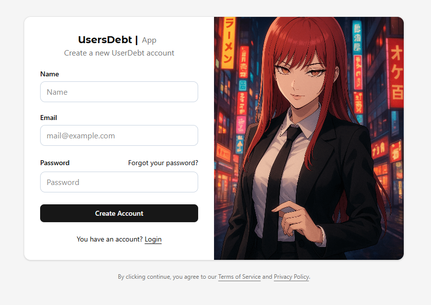
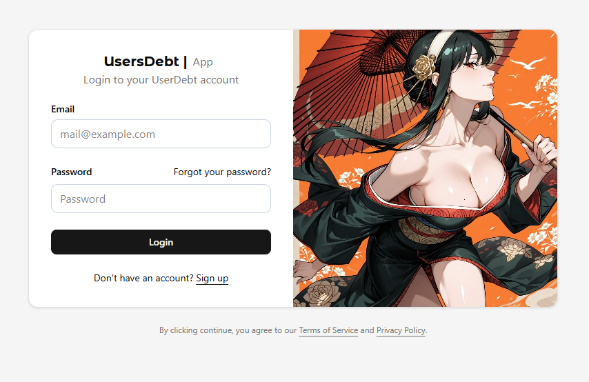
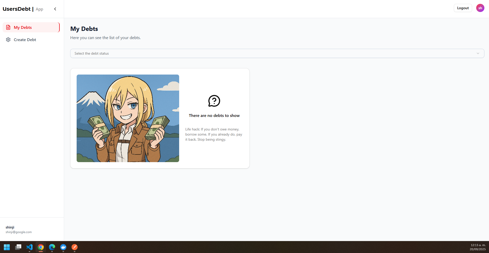
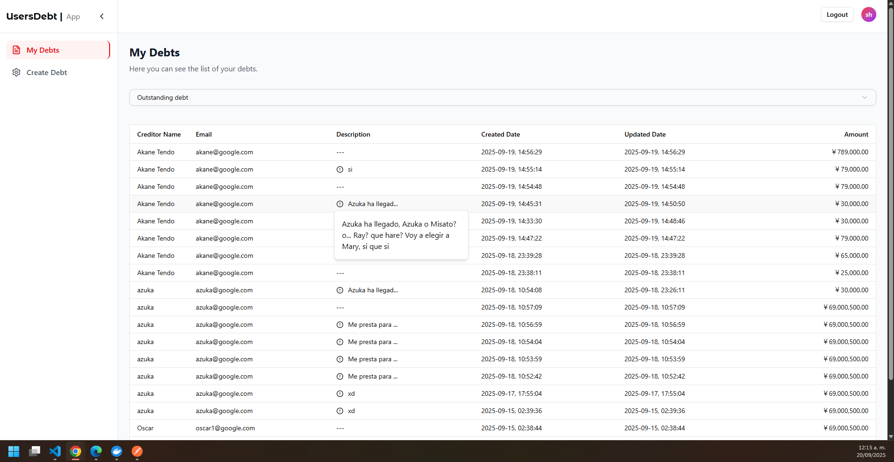
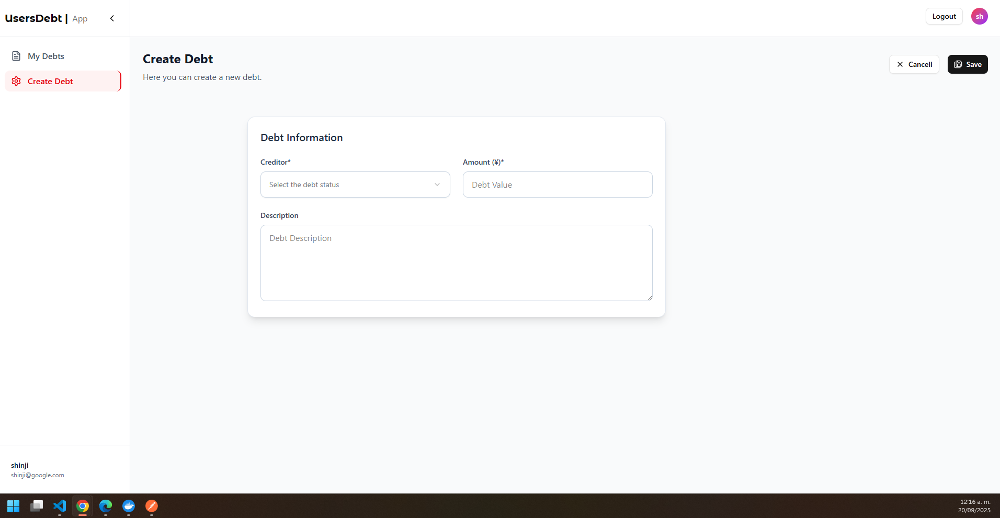

# UserDebts App - React + TypeScript + Vite

This template provides a minimal setup to get React working in Vite with HMR and some ESLint rules.

## Instrucciones de despliegue local
⚠️ Requiere Node v+22

1. Clonar el repositorio
2. Clonar el archivo .env.template y renombrarlo a .env
3. Clonar, configurar y correr el repostitorio del backend `https://github.com/oscarrodriguezbu/debt-management-backend`
4. Ejecutar el comando `npm install` para instalar las dependencias
5. Verificar que el backend este corriendo en el puerto 3000
6. Ejecutar el comando `npm run dev` para iniciar el servidor de desarrollo

## Contexto del reto:

Imagina que estás construyendo una aplicación para gestionar deudas entre amigos. Cada usuario puede registrar deudas, pagarlas y consultar el estado. El reto consiste en construir un MVP funcional con las siguientes condiciones:

### Frontend React:

● Pantalla de Login/Registro. ✅

● Pantalla de listado de deudas con filtros (pendientes/pagadas). ✅

● Formulario para crear una nueva deuda. ✅

● Vista de detalle de una deuda. ✅

● UI moderna, minimalista y responsiva (no se evalúa diseño perfecto, sino organización y buenas prácticas). ✅

## 🚀 Tecnologías utilizadas

- **React 19**: Librería principal para la construcción de interfaces.
- **Vite**: Bundler ultrarrápido para desarrollo y build.
- **TypeScript**: Tipado estático para mayor robustez y mantenibilidad.
- **React Router 7**: Manejo de rutas (login, listado de deudas, detalle, etc.).
- **React Hook Form**: Manejo de formularios con validaciones.
- **TanStack React Query**: Manejo eficiente de datos asíncronos y caché.
- **Axios**: Cliente HTTP para comunicación con la API.
- **Zustand**: Manejo de estado global ligero.
- **TailwindCSS**: Estilos modernos, responsivos y minimalistas.
- **Radix UI + Lucide React**: Componentes accesibles y consistentes.

## ⚙️ Decisiones técnicas

- Vite + React + TypeScript: Permite un entorno de desarrollo rápido, tipado y fácil mantenimiento.

- React Query: Para manejar peticiones a la API, caché de datos y estados de error/carga de forma declarativa.

- Zustand: Estado global sencillo para manejar autenticación y datos compartidos.

- React Hook Form: Mejor manejo de formularios con validaciones eficientes.

- TailwindCSS + Radix UI: Estilos consistentes, accesibles y con foco en rapidez de desarrollo.

- Arquitectura modular: Separación en carpetas de pages, components, hooks, services y store para mayor claridad.

## ✅ Buenas prácticas aplicadas

- Uso de tipado estricto con TypeScript.

- Separación clara entre UI y lógica de negocio.

- Manejo centralizado de estado global y side effects.

- Formularios controlados con validaciones.

- Hooks personalizados para encapsular lógica repetitiva.

- Enfoque en accesibilidad y responsividad.

## 📸 Screenshots

### 📝 Registro de Usuario

### 🔑 Login

### 📋 Listado de Deudas

### ➕ Creación de una Deuda

